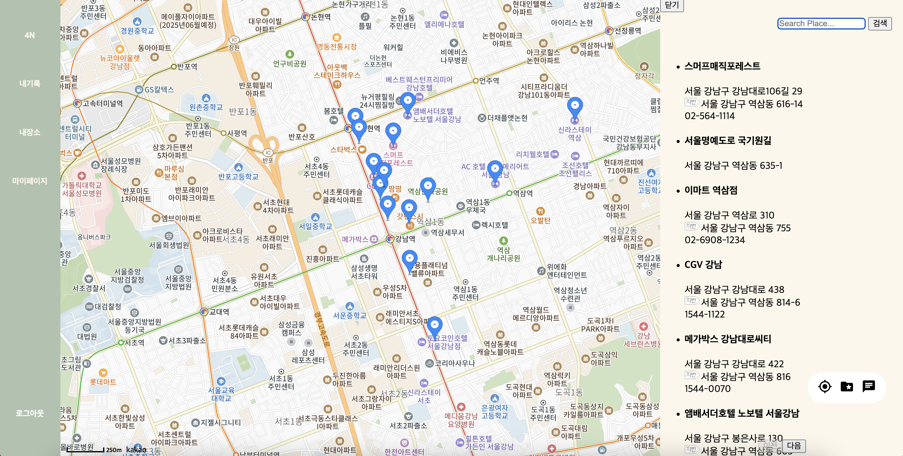
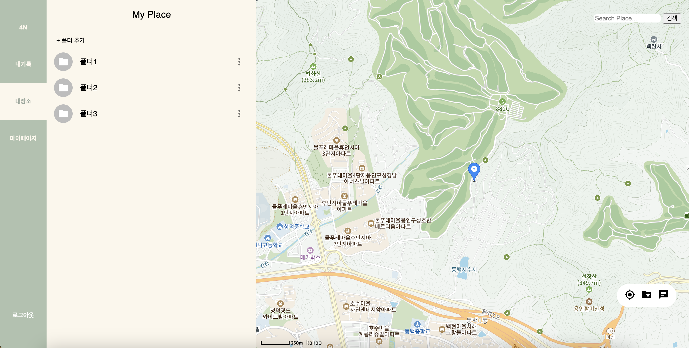
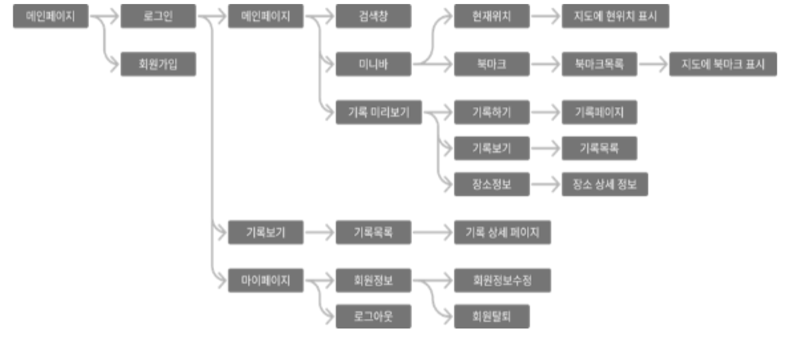
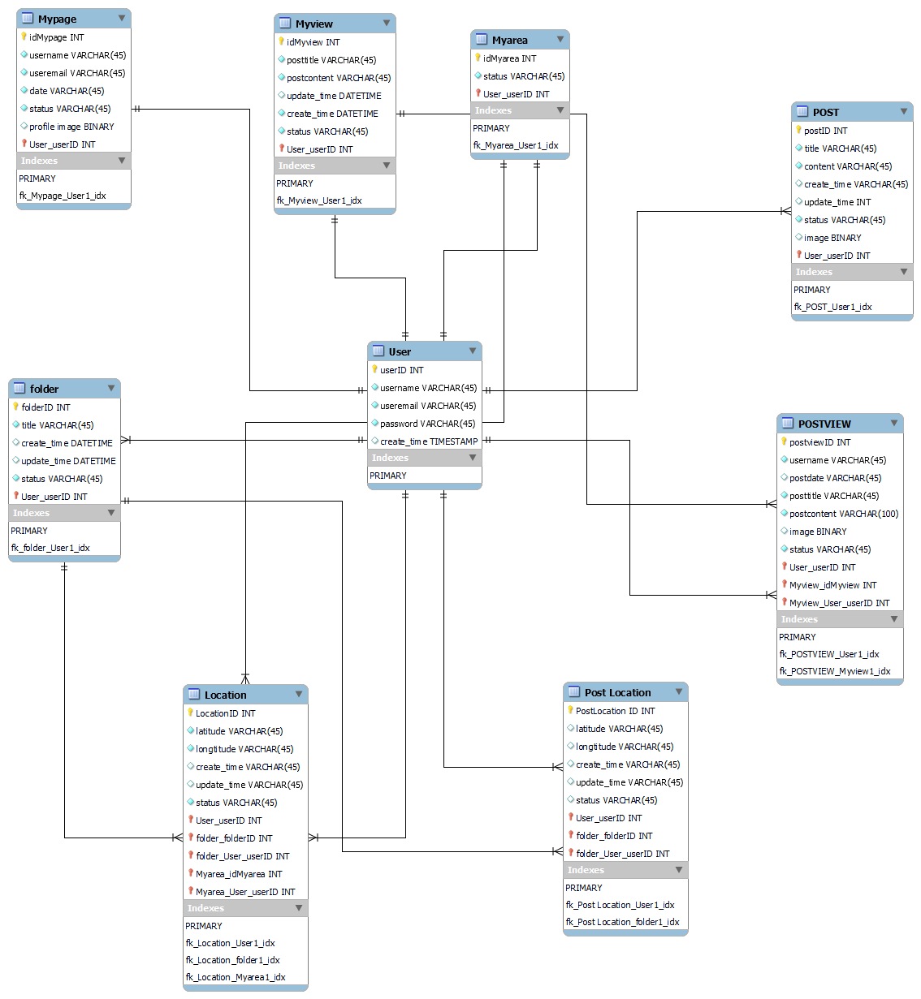

## MapLog | 나만의 일기 지도 ⛳️

### ⏰개발기간
- 2023.04 ~ 2023.11

  
### 👥Team
- FrontEnd - 한별, 하지민
- BackEnd - 김민성, 임서하
  

### 👤Role
1. FrontEnd : 
  - 회원가입 ui 구현 및 api연결
  - 로그아웃 기능 구현
  - 지도 구현
  - 현위치 찾기 기능 구현
  - 장소 검색 ui
  - 일기 작성,조회,편집,삭제 기능 UI 구현 및 api 연결
  - 로그인 상태 유지
  - 마이페이지 회원 정보 UI 구현 및 api 연결
  - 메뉴바 UI
  - 폴더 생성, 조회, 삭제 기능 UI 구현 및 api 연결
  - 폴더에 장소 저장, 저장된 장소 조회, 삭제 기능 UI 구현 및 api 연결
2. PM : 
  - 백로그 작성(공동)
  - 스프린트, 스크럼 관리
  - 업무 분배, 조율
3. Design :
  - Figma로 와이어 프레임 제작 및 디자인 

### 📌Skill
- FrontEnd
  - Html
  - CSS
  - JavaScript
  - React
  - Kakao Map API
  - Zustand
  - Rest API
  - Axios
- BackEnd
  - Python
  - Django
  - SQLight
  - AWS(EC2)

### 📄프로젝트 설명 
kakao map api를 사용해 지도를 구현하고, 장소와 관련된 일기를 작성하고 편집할 수 있는 CRUD기능이 있는 웹 애플리케이션입니다. 
- 회원가입 / 로그인 / 로그아웃
- 일기 작성 / 수정 / 삭제
- 현 위치 찾기
- 장소 검색
- 폴더 생성 / 조회 / 삭제
- 폴더에 장소 저장 / 조회 / 삭제

### 📺시연 영상
https://youtu.be/_agvMB7dfk0?si=pLTCWLs0BLaGwxfr   

  
### 🗓️Plan
#### 메뉴 구성도

#### ERD

